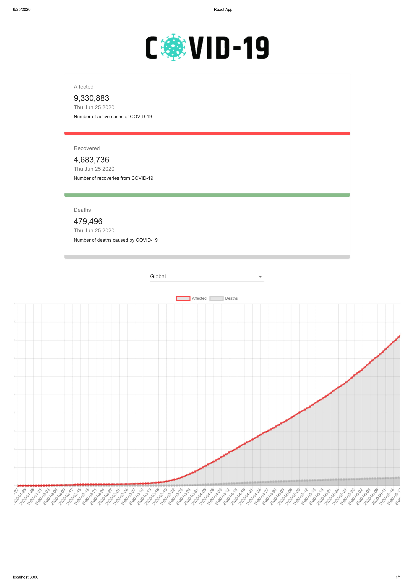

# COVID-19 Tracker

Corona Virus is, unfortunately, spreading through the entire world.

We can help to spread awareness by visualizing the data. So I tried to visulaize the number of people Affected, Recovered, Died
by COVID-19 Country-wise.

The data is fetched from the [**API**](https://covid19.mathdro.id/api)
and we'll create cards displaying the statistics as well as Charts.

This project/application is created using the ReactJS, Material UI, Charts.JS.

API used: [https://covid19.mathdro.id/api](https://covid19.mathdro.id/api)
